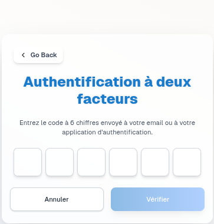

Pour commencer à utiliser **BIOLAB**, il faut avoir un **compte** et se connecter de manière **sécurisée**.

Création de compte
===================

* Cliquez sur **"S’inscrire"** si vous n’avez pas encore de **compte**.

.. image:: ../images/image0FR.png

* Remplissez le **formulaire** avec vos **informations personnelles** : **nom**, **email**, **mot de passe**, etc.

* Une fois **validé**, votre **compte** est créé et vous pouvez passer à la **connexion**.

Connexion
==========

* Rendez-vous sur la **page de connexion** et entrez votre **email** et **mot de passe**.

* Vous recevrez un **OTP (One Time Password)** par **email**.

* Ce **code** est valable **5 minutes**.

* **Saisissez-le** pour finaliser la **connexion**.

* Après cela, vous êtes redirigé vers votre **tableau de bord** et pouvez commencer à utiliser la **plateforme**.

