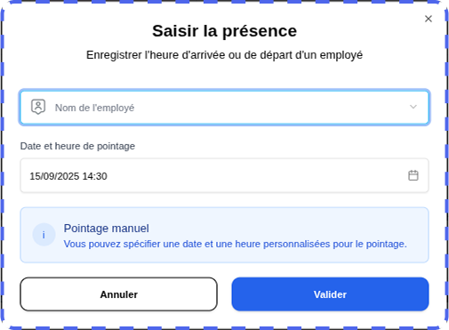
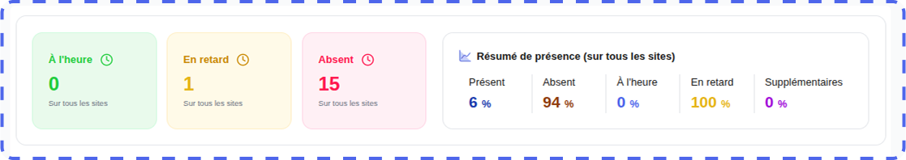
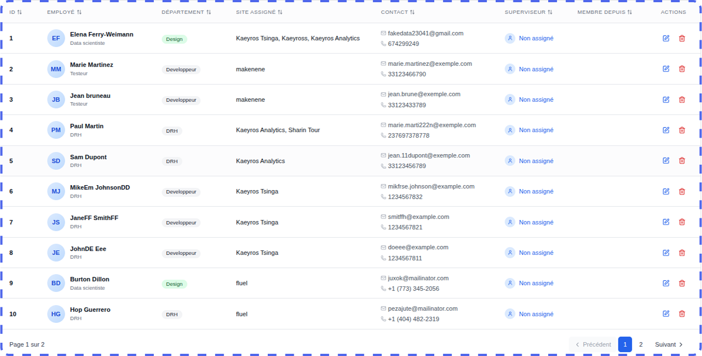
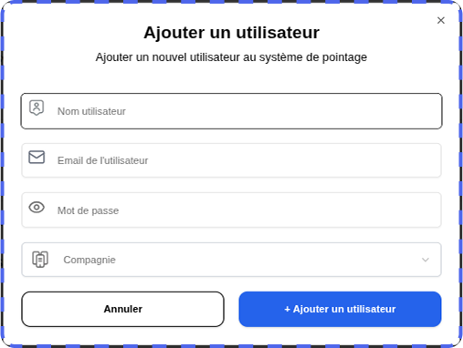

Overview
=========

The time and attendance platform developed by **Kaeyros Analytics** offers two types of use:

* **Internal Administration**: Attendance tracking and user management for your company;
* **Distribution**: Solution management for other client organizations (function reserved for **Reseller** accounts).

This guide describes step-by-step how to use the platform, from login to reporting.

Connecting to the Platform
=====================================================

The administration platform is accessed via a web browser. Here are the steps to log in:

* **Open your browser** (Google Chrome, Firefox, Edge, etc.);
* Enter the following URL: "https://pointing-front.kaeyros.org";
* Enter the **login details** provided when you subscribed to the **service** (email address and password);
* Click on **"Login"** to access your account.

.. image:: ../images/image1.png

If you forget your password, please contact us to obtain a new one.
Once logged in, you will have direct access to the attendance logs, where you can view employee attendance data for the day of your choice.

.. image:: ../images/image2.png

Attendance Logs
====================================

Once logged in to the attendance logs, you can:

* view attendance for a given day,
* manually enter attendance,
* download the attendance report,
* view the overall reporting.

**i. Browse Days**

To change the day, click on the calendar where the date is displayed, as shown in the screenshot below.

.. image:: ../images/image3.png

**ii. Manually Record Attendance**

This function is reserved for authorized personnel (e.g., receptionists) to manually record an employee's attendance.

1. Click the **Enter Attendance** button.

.. image:: ../images/image4.png

2. In the dialog box that opens, select:

* The employee concerned;

* The corresponding site

3. Click **Validate** to record the attendance; it will be immediately displayed in the daily summary table.

**Important**: Each employee must clock in **twice a day**:

* **Entry**: arrival time;
* **Exit**: Departure time.

**iii. Download the daily attendance report**

You can generate a daily attendance report to track your employees' activity.

1. Select the day for which you would like to view the report.

2. Click the **Export** button.

.. image:: ../images/image6.png

3. The Excel file containing all employees' attendance records for the selected day will be automatically downloaded.

.. image:: ../images/image7.png

**File Structure**:

* **Employee**: Employee name;
* **In/Out**: Clock-in time;
* **Site**: Clock-in location;
* **Late by**: Length of time late, if any;
* **In/Out Type**: Clocking method;

**iv. View Daily Attendance Statistics**

You can view:

* The number of employees who arrived on time;
* The number of employees who were late;
* The attendance, lateness, and punctuality percentages, displayed on the right side of the dashboard.

**v. View Attendance Details**

.. image:: ../images/image9.png

The data displayed reflects the columns in the Excel report: arrival and departure times, location, lateness, overtime, and balance.

You can also use the following options to search by employee name, filter by location, and switch between pages using the pagination menu.

**vi. View general reporting**
General reporting allows you to analyze employee attendance trends over an extended period (month, quarter, year). Unlike the daily dashboard, this view provides an overall summary to help assess punctuality and attendance at the company or department level.

1. From the **Main Dashboard**, click on the **View General Reporting** link.

.. image:: ../images/image10.png

2. You will be automatically redirected to the **Second Dashboard**, dedicated to overall analyses.

.. image:: ../images/image11.png

3. Select the desired period (**month, quarter, year**) using the available filters.

Configure your platform
========================================

The initial configuration is **reserved for users with the Administrator role**. It allows you to define the essential elements of the company:

* **Sites**
* **Working Hours**
* **Departments**
* **Positions**

All these options are accessible from the **Settings tab** of the platform.

**i. Add Sites**

1. Go to the **Settings** tab. You are automatically redirected to the **Sites** sub-tab. Then, click the Add Site button to create and configure a new site within your company.

   .. image:: ../images/image12.png

2. A dialog box will open. Enter the following information:

* **Site Name**;
* **Phone Number** (used for the WhatsApp time and attendance integration);
* **Site Address**;
* **Geographic Coordinates** (click **Get Location**, making sure to enable geolocation on your device).

.. image:: ../images/image13.png

3. Click **Next** to set the working hours:

* Select the **working days**;
* Indicate the **opening and closing hours** (e.g., 8:30 a.m. – 5:30 p.m.).

.. image:: ../images/image14.png

4. Click **Validate** to finalize.

Once validated, a **QR Code** is automatically generated. It will serve as a time clock for employees at the site in question.

.. image:: ../images/image15.png

**Tip**: Before printing or distributing, test the QR Code to ensure it redirects to the configured WhatsApp number.

**ii. View and edit a site**

1. Still in the **Sites** sub-tab, view the list of sites already created.

.. image:: ../images/image16.png

2. To modify or delete a site, click **Edit Site**:

* You can modify the **name**, **phone number**, **geographic coordinates**, and **hours**;
* You can also **delete** a site if necessary.

3. To download the QR code for an existing site, click **Download** at the bottom of **Edit Site**.

**iii. Configure Working Hours**

1. Go to the **Hours** sub-tab in the **Settings** tab.

2. Select the relevant site from the drop-down list.

.. image:: ../images/image17.png

3. Modify the hours as desired (working days, opening/closing hours).

4. Save your changes by clicking **Validate**.

**iv. Configure Departments**

1. Go to the **Department** sub-tab.

.. image:: ../images/image18.png

2. You can:

* View the list of existing departments;
* **Modify** a department name using the **edit** button;
* **Delete** a department using the **edit** button.

**v. Configure Positions**

1. Go to the **Position** sub-tab.

.. image:: ../images/image19.png

2. You can:

* View all positions in the company;
* **Modify** a position title or description;
* **Delete** an existing position using the edit button.

Employee Management
============================

This is done on the Employees tab.

.. image:: ../images/image20.png

On this tab, you can view the employees registered in the company, add an employee, edit an employee's information, or delete an employee.

**i. Add an Employee**

By clicking the **Add Employee** button, a dialog box will open and you will enter the employee's name, phone number, email address, position, and department.

.. image:: ../images/image21.png

Note: For the phone number, make sure you enter the number exactly as it is entered on WhatsApp (for example, numbers without a 6 like 23789898989 and numbers with a 6 like 237689898989).

**ii. Viewing, Editing, and Deleting an Employee**

Everything works exactly as in the other cases. From the edit button, you can choose either the edit or delete option, depending on what you want to do.

Account Management
=========================

This is done in the **Company Space** tab. Only users with the Admin or Account Manager role can see this tab.

.. image:: ../images/image23.png

In this section, there are two main features: Add a New Company and Add a User.

**i. Add a company**

This feature allows you to create a new company to which you wish to sell the timekeeping tool. You must add the company here and add a user who will manage it.

By clicking the **Add Company** button, a dialog box will open and you must enter the information for the company you wish to add at this level.

.. image:: ../images/image24.png

.. image:: ../images/image241.png

You must enter the company name, the name of a company manager, the email address, and phone number of the company or company manager, then click the Confirm button to complete the company creation. You cannot create two companies with the same phone number.

**ii. View, edit, and delete companies.**

.. image:: ../images/image25.png

Once you create a company, it is automatically added to the list of companies, as shown in the image above. Using the edit button on the far right of each company, you can modify the company's information by clicking Edit or delete the company by clicking Delete.

Note: If you have the Account Manager role, you can only view and modify companies you have added. Therefore, you cannot modify a company added by the administrator or another user with the Account Manager role.

**iii. Add a User**

Generally, when you create a company, you need to add a user to that company who will manage it. You must grant them the Admin role.

In the User sub-tab, simply click the Add User button to trigger the process of adding a new user.

.. image:: ../images/image26.png

This will open a dialog box and you will need to fill in the various fields for this user.

It will be up to you to send these credentials to the user in question so they can access the platform to manage their business. These include their email address and password. Every user needs these two pieces of information to log in to the platform.

**i. View, edit, and delete a user.**

.. image:: ../images/image28.png

When you add a new user, they are automatically added to the user list, as shown in the image above. Using the edit button on the far right of each user, you can modify a user's information by clicking Edit or, if possible, delete them by clicking Delete.

NB: If you have the Account Manager role, you can only view and edit users you have added. Therefore, you cannot edit a user added by the administrator or another Account Manager.