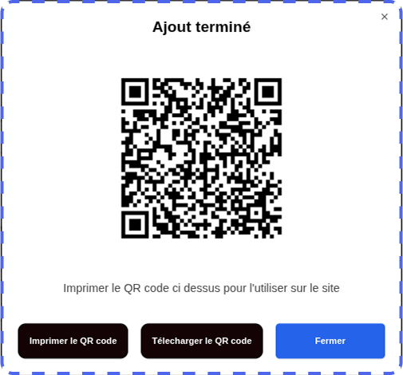
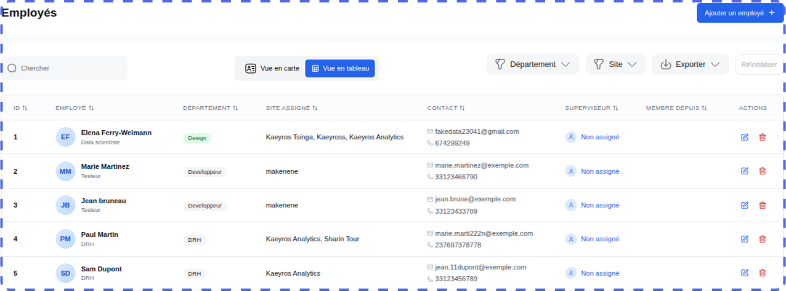
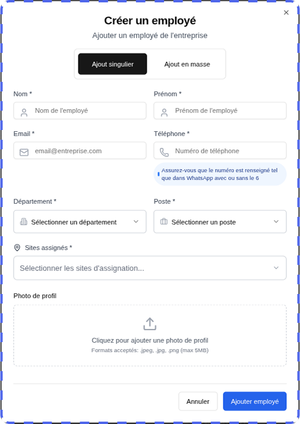

Overview
=========

The time and attendance platform developed by **Kaeyros Analytics** offers two types of use:

* **Internal Administration**: Attendance tracking and user management for your company;
* **Distribution**: Solution management for other client organizations (function reserved for **Reseller** accounts).

This guide describes step-by-step how to use the platform, from login to reporting.

Connecting to the Platform
========================================

The administration platform is accessed via a web browser. Here are the steps to log in:

* **Open your browser** (Google Chrome, Firefox, Edge, etc.);
* Enter the following URL: "https://pointing-front.kaeyros.org";
* Enter the **login details** provided when you subscribed to the **service** (email address and password);
* Click on **"Login"** to access your account.

.. image:: ../images/image1.png

If you forget your password, please contact us to obtain a new one.

Once logged in, you will have direct access to the attendance logs, where you can view employee attendance data for the day of your choice.

.. image:: ../images/image2.png

Attendance Logs
============================

Once logged in to the attendance logs, you can:

* view attendance for a given day,
* manually enter attendance,
* download the attendance report,
* view the overall report,
* view attendance.

**1. Viewing Daily Attendance**

This feature allows you to quickly view the list of employees present on a specific day. It displays arrival and departure times, as well as any absences or lateness. Change the day by clicking on the calendar where the date is displayed, as shown in the screenshot below:

**2. Manual Attendance Entry**

This feature allows you to directly and manually record an employee's attendance for a given day, specifying arrival and departure times.

* Click the **Enter Attendance** button.

.. image:: ../images/image4.png

* In the dialog box, select the employee concerned, the corresponding site, and then the time and date of attendance. This interface allows you to manually check and record each piece of information to ensure data reliability, particularly in the event of corrections or exceptional additions. Entry is quick thanks to dedicated fields for each element, ensuring that attendance is correctly assigned to the correct employee and site.

.. image:: ../images/image5.png

* Click **Validate** to record attendance; it will be immediately displayed in the daily summary table.

**Important**: Essential Reminder

Each employee must record two time and attendance records during the day:

- Arrival time when entering the site

- Departure time when leaving

This process ensures transparent and rigorous management of attendance times, facilitating HR data tracking and compliance.

**3. Downloading the Attendance Report**

This option allows you to export the attendance report as a file, grouping all employee time and attendance data for the selected period. The report includes arrival and departure times, absences, tardiness, and any other information useful for tracking work time.

* Select the day for which you would like to view the report.
* Click the **Export** button.

.. image:: ../images/image6.png

* The Excel or CSV file containing all employee attendance for the selected day will be automatically downloaded, ready for viewing or analysis.

.. image:: ../images/image7.png

**File Structure**:

* **Employee**: Full name of the employee;
* **In/Out**: Corresponding clock-in times;
* **Site**: Clock-in location;
* **Late by**: Possible duration of the delay;
* **In/Out Type**: Clocking method (manual, automatic)

**4. View Global Reporting**

This feature provides a consolidated view of employee attendance data over a given period. It allows you to track arrival and departure times, lateness, and absences, providing a comprehensive dashboard for human resources management.

.. image:: ../images/image8.png

You can also search by employee name, filter by site, and switch between pages using the pagination menu.

**5. View Attendance Details**

.. image:: ../images/image9.png

This feature provides access to detailed information on employee attendance. It provides a granular view to analyze each employee's punctuality and attendance.This facilitates operational management and rigorous monitoring of working hours within the company.

*View reporting*

This involves presenting the collected data in a clear and concise format, often through dashboards, graphs, or key performance indicators (KPIs). This presentation facilitates the analysis of attendance trends, the identification of deviations from planned schedules, and the monitoring of compliance with internal regulations.

.. image:: ../images/image101.png

Configuring your platform
=======================================

The initial configuration of the platform is reserved for users with administrator roles. It allows you to define sites, work schedules, departments, and positions, thus ensuring a clear and personalized organization of the essential parameters for attendance management.

To access it, simply click on the **Configurations** tab of the platform.

**1. Add Sites**

To add a new site, go to the **Configurations** tab, then **Add Site**

.. image:: ../images/image12.png

A dialog box will open. Enter the following information:

* **Site Name**
* **Phone Number** (used for the WhatsApp integration of the time clock)
* **Site Address**
* **Geographic Coordinates** (click **Get Location**, making sure to enable geolocation on your device).

.. image:: ../images/image13.png

Click **Next** to define the working hours:

* Select the **working days**;
* Indicate the **opening and closing hours** (e.g., 8:30 a.m. – 5:30 p.m.).

.. image:: ../images/image14.png

Click **Validate** to finalize.

Once validated, a **QR Code** is automatically generated. It will serve as a time clock for employees at the site in question.

**Tip**: Before printing or distributing, be sure to test the QR Code to ensure it correctly redirects to the configured WhatsApp number.

*View and edit a site*

You can view the list of sites already created.

You can edit, delete, or download the QR Code associated with a site by clicking on the three dots to the right of the site name, as shown in the screenshot below.

.. image:: ../images/image161.png

**2. Configure work schedules**

- Go to the **Hours** sub-tab in the **Settings** tab.

- Select the relevant site from the drop-down list.

.. image:: ../images/image17.png

- Modify the schedules as desired (working days, opening/closing hours).

- Save your changes by clicking **Validate**.

**3. Configure departments**

- Go to the **Departments** sub-tab.

.. image:: ../images/image18.png

- You can view the list of existing departments, modify them, or delete them.

**4. Configure positions**

- Go to the **Positions** sub-tab.

.. image:: ../images/image19.png

- You can view the list of existing positions, modify them, or delete them.

Employee Management
=============================

From the **Employees** tab, attendance management begins by creating each employee's profile, which contains their key information: identity, position, department, hours, and work locations. This profile allows you to precisely associate the clocking and attendance records, ensuring reliable and personalized monitoring of attendance, lateness, and absences.

On this tab, you can view the employees registered in the company, add an employee, modify an employee's information, or delete an employee.

**1. Add an Employee**

By clicking the **Add Employee** button, a dialog box will open and you will enter the employee's name, phone number, email address, position, and department.

Note: For the phone number, make sure to enter the number exactly as it is on WhatsApp (for example, numbers without a 6 like 23789898989 and numbers with a 6 like 237689898989).

**2. View, Edit, and Delete an Employee**

From the Employees tab, you can easily edit or delete an employee.

.. image:: ../images/image22.png

Account Management
========================

This is done in the **Company Space** tab. Only users with the Admin or Account Manager role can see this tab.

.. image:: ../images/image23.png

In this section, there are two main features: Add a New Company and Add a User.

**1. Add a Company**

This feature allows you to create a new company to which you wish to sell the timekeeping tool. You must add the company here and add a user.

The user who will manage this company.

By clicking the **Add Company** button, a dialog box will open and you must enter the information for the company you want to add at this level.

.. image:: ../images/image24.png

.. image:: ../images/image241.png

You must enter the company name, the name of a company manager, the email address and phone number of the company or company manager, then click the Confirm button to complete the company creation. You cannot create two companies with the same phone numbers.

**2. View, edit, and delete companies.**

.. image:: ../images/image25.png

When you create a new company, it is automatically added to the list of companies, as shown in the image above. Using the edit button on the far right of each company, you can modify the company's information by clicking Edit or delete the company by clicking Delete.

Note: If you have the Account Manager role, you can only view and modify companies you have added. Therefore, you cannot modify a company added by the administrator or another user with the Account Manager role.

3. Add a User

Generally, when you create a company, you need to add a user to that company who will manage it. You must grant them the Admin role.

In the User sub-tab, simply click the Add User button to trigger the process of adding a new user.

.. image:: ../images/image26.png

This will open a dialog box and you will need to fill in the various fields for this user.

.. image:: ../images/image27.png

It will be up to you to send these credentials to the user in question so that they can access the platform to manage their business. These include their email address and password. Every user needs these two pieces of information to log in to the platform.

*View, edit, and delete a user.*

.. image:: ../images/image28.png

When you add a new user, they are automatically added to the user list, as shown in the image above. Using the edit button on the far right of each user, you can modify a user's information by clicking Edit or, if possible, delete them by clicking Delete.

Note: If you have the Account Manager role, you can only view and edit the users you have added. So you cannot edit a user added by the administrator or another Account-Manager.