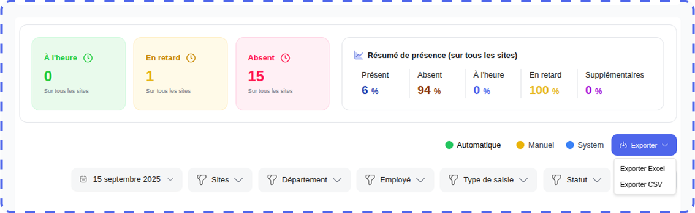
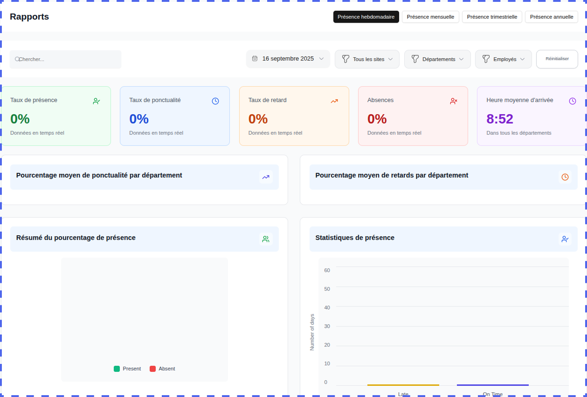
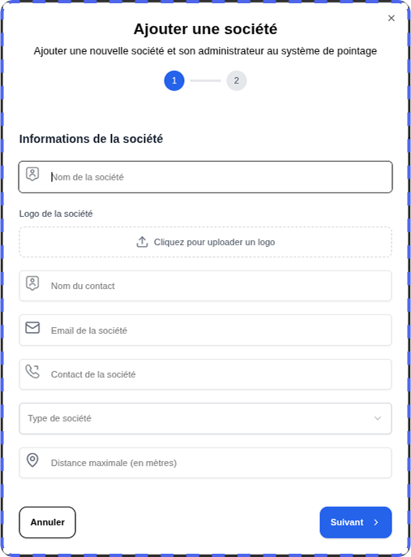
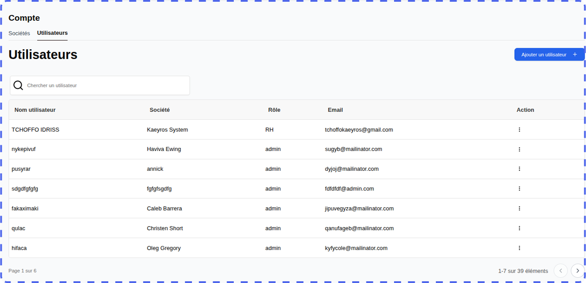

Aperçu
=========

La plateforme de pointage développée par **Kaeyros Analytics** permet deux types d’utilisation :

* **Administration interne** : suivi des présences et gestion des utilisateurs de votre entreprise ;
* **Distribution** : gestion de la solution pour d’autres structures clientes (fonction réservée aux comptes **Reseller**).

Ce guide décrit étape par étape l’utilisation de la plateforme, depuis la connexion jusqu’au reporting.

Connexion à la plateforme
====================================

L’accès à la plateforme d’administration se fait via un navigateur web. Voici les étapes à suivre pour se connecter :

* **Ouvrez votre navigateur** (Google Chrome, Firefox, Edge, etc.) ;
* Saisissez l’URL suivante : « https://pointing-front.kaeyros.org » ;
* Renseignez les **identifiants fournis** lors de la souscription au **service** (adresse e-mail et mot de passe) ;
* Cliquez sur **« Connexion »** pour accéder à votre espace.

.. image:: ../images/image1.png

En cas d’oubli de mot de passe, veuillez nous contacter afin d’en obtenir un nouveau.

Une fois connecté, vous aurez un accès direct aux journaux de présence, où vous pourrez consulter les données de présence des employés pour la journée de votre choix.

.. image:: ../images/image2.png

Journaux de présence
===========================

Une fois connecté aux journaux de présence, vous pouvez :

* visualiser les présences pour une journée donnée,
* saisir manuellement une présence,
* télécharger le rapport de présence,
* consulter le reporting global,
* consulter les présences.

**1. Visualisation des présences journalières**

Cette fonctionnalité permet de consulter rapidement la liste des employés présents sur une journée spécifique. Elle affiche les heures d’arrivée et de départ, ainsi que les éventuelles absences ou retards. Changez de jour en cliquant sur le calendrier où la date est affichée, comme illustrée dans la capture ci-dessous:

.. image:: ../images/image3.png

**2. Saisie manuelle des présences**

Cette fonctionnalité permet d’enregistrer directement et manuellement la présence d’un employé pour une journée donnée, en spécifiant les heures d’arrivée, de départ.

* Cliquez sur le bouton **Saisir la présence**.

.. image:: ../images/image4.png

* Dans la boîte de dialogue, sélectionnez l’employé concerné, le site correspondant, puis  l’heure et la date de présence. Cette interface permet de contrôler et d’enregistrer chaque information à la main pour garantir la fiabilité des données, notamment en cas de correction ou d’ajout exceptionnel. La saisie se fait rapidement grâce à des champs dédiés pour chaque élément, assurant que la présence soit bien rattachée au bon salarié et au bon site.

.. image:: ../images/image5.png

* Cliquez sur **Valider** pour enregistrer la présence, elle sera immédiatement affichée dans le tableau récapitulatif de la journée. 

.. image:: ../images/image50.png

**Important** : Rappel essentiel 

Chaque salarié doit enregistrer deux pointages au cours de la journée :

- Heure d’arrivée lors de l’entrée sur le site

- Heure de départ à la sortie

Ce processus garantit une gestion transparente et rigoureuse des temps de présence, facilitant le suivi et la conformité des données RH.

**3. Téléchargement du rapport de présence**

Cette option permet d’exporter le rapport de présence sous forme de fichier, regroupant toutes les données de pointage des salariés pour la période sélectionnée. Le rapport inclut les horaires d’arrivée et de départ, les absences, les retards et toute information utile au suivi du temps de travail.

* Sélectionnez le jour pour lequel vous souhaitez obtenir le rapport.  
* Cliquez sur le bouton **Exporter**.

* Le fichier Excel ou CSV regroupant les présences de tous les employés pour la journée sélectionnée sera téléchargé automatiquement, prêt à être consulté ou analysé.

.. image:: ../images/image7.png

**Structure du fichier** :

* **Employé** : nom complet de l’employé ;
* **Entrée / Sortie** : heures de pointage correspondantes ;
* **Site** : lieu du pointage ;
* **En retard de** : durée éventuelle du retard ;
* **Type entrée / sortie** : mode de réalisation du pointage (manuel, automatique)

**4. Consultation du reporting global**

Cette fonctionnalité offre une vue consolidée des données de présence des employés sur une période donnée. Elle permet de suivre les heures d’arrivée et de départ, les retards et absences, offrant ainsi un tableau de bord complet pour le pilotage des ressources humaines.

.. image:: ../images/image8.png

Vous pouvez aussi faire une recherche à partir du nom de l’employé, filtrer par le site, et basculer entre les pages en utilisant le menu de pagination.

**5. Voir les détails sur les présences**

.. image:: ../images/image9.png

Cette fonctionnalité permet d’accéder aux informations précises sur les présences des employés. Elle offre une vision granulaire pour analyser la ponctualité et l’assiduité de chaque salarié, facilitant ainsi la gestion opérationnelle et le suivi rigoureux des temps de travail au sein de l’entreprise.

*Visualiser le reporting*

Elle consiste à présenter les données collectées sous forme claire et synthétique, souvent à travers des tableaux de bord, graphiques ou indicateurs clés (KPIs). Cette présentation facilite l’analyse des tendances de présence, l’identification des écarts par rapport aux horaires prévus, et le suivi de la conformité aux règles internes. 

Paramétrer sa plateforme
===================================

La configuration initiale de la plateforme est réservée aux utilisateurs disposant d’un rôle administrateur. Elle permet de définir les sites, les horaires de travail, les départements ainsi que les postes, garantissant ainsi une organisation claire et personnalisée des paramètres essentiels à la gestion des présences.

Pour y acceder, il suffit de cliquet sur l’onglet **Configurations** de la plateforme.

**1. Ajouter les sites**

Pour ajouter un nouveau site, depuis l'onglet **Configurations**, puis **Ajouter un site** 

.. image:: ../images/image12.png 

Une boîte de dialogue s’ouvre. Renseignez les informations suivantes :

* **Nom du site** 
* **Numéro de téléphone** (utilisé pour l’intégration WhatsApp du pointage) 
* **Adresse du site** 
* **Coordonnées géographiques** (cliquez sur **Obtenir la localisation**, en veillant à activer la géolocalisation sur votre appareil).

Cliquez sur **Suivant** pour définir les horaires de travail :

* Sélectionnez les **jours ouvrables** ;
* Indiquez les **heures d’ouverture et de fermeture** (ex. : 08h30 – 17h30).

.. image:: ../images/image14.png

Cliquez sur **Valider** pour finaliser.

Une fois validé, un **QR Code** est automatiquement généré. Il sert de pointage pour les employés sur le site concerné.

.. image:: ../images/image15.png

**Conseil** : Avant toute impression ou diffusion, veillez à tester le QR Code afin de vous assurer qu’il redirige correctement vers le numéro WhatsApp configuré.

*Visualiser et modifier un site*

Vous pouvez consulter la liste des sites déjà créés.

.. image:: ../images/image16.png

Vous pouvez éditer, supprimer ou télécharger le QR Code associé à un site en cliquant sur les trois points situés à droite du nom du site, comme illustré dans la capture ci-dessous.

.. image:: ../images/image161.png

**2.Configurer les horaires de travail**

- Accédez au sous-onglet **Horaires** dans l’onglet **Paramètres**.  
- Sélectionnez le site concerné dans la liste déroulante.

.. image:: ../images/image17.png

- Modifiez les horaires comme souhaité (jours ouvrables, heures d’ouverture/fermeture).  
- Enregistrez vos modifications en cliquant sur **Valider**.

**3. Configurer les départements**

- Rendez-vous dans le sous-onglet **Départements**.

.. image:: ../images/image18.png

- Vous pouvez visualiser la liste des départements existants, les modifier ou supprimer.

**4. Configurer les postes**

- Accédez au sous-onglet **Postes**.

.. image:: ../images/image19.png

- Vous pouvez visualiser la liste des postes existants, les modifier ou supprimer.

Gestion des employés
===========================

Depuis l’onglet **Employés**, la gestion de la présence débute par la création du profil de chaque employé, qui contient ses informations clés : identité, poste, département, horaires et sites d’affectation. Ce profil permet d’associer précisément les pointages effectués, assurant ainsi un suivi fiable et personnalisé des présences, retards et absences.

.. image:: ../images/image20.png

Sur cet onglet, on peut visualiser les employés enregistrés dans l’entreprise, ajouter un employé, modifier les informations d’un employé ou supprimer un employé.

**1. Ajouter un employé**

En cliquant sur le bouton **Ajouter un employé**, une boîte de dialogue va s’ouvrir et vous allez renseigner le nom de l’employé, son numéro de téléphone, l’adresse mail, le poste et le département de l’employé.

.. image:: ../images/image21.png

Attention : pour le numéro de téléphone, il faut se rassurer de renseigner le numéro tel qu’il est renseigné sur WhatsApp (par exemple, les numéros sans 6 comme 23789898989 et les numéros avec 6 tels que 237689898989).

**2. Visualiser, modifier et supprimer un employé**

Depuis l’onglet Employés, vous pouvez modifier ou supprimer un employé facilement.

.. image:: ../images/image22.png

Gestion des comptes
=======================

Elle se fait dans l’onglet **Espace entreprise**. Seuls les utilisateurs qui ont le rôle d’Admin ou d’account manager peuvent voir cet onglet.

.. image:: ../images/image23.png

Sur cette section, il y a deux principales fonctionnalités : Ajouter une nouvelle société et Ajouter un utilisateur.

**1. Ajouter une Société**

Cette fonctionnalité vous permet de créer une nouvelle société à qui vous souhaitez vendre l’outil de pointage. Vous devez ajouter la société ici et ajouter un utilisateur qui va gérer cette société.

En cliquant sur le bouton **Ajouter une société**, une boîte de dialogue va s’ouvrir et vous devez renseigner les informations de la société que vous voulez ajouter à ce niveau.

.. image:: ../images/image241.png

Il faut renseigner le nom de la compagnie, le nom d’un responsable de la compagnie, l’adresse mail et le téléphone de la société ou du responsable d’une société, puis cliquer sur le bouton de validation pour terminer la création de la société. Vous ne pouvez pas créer deux sociétés avec les mêmes numéros de téléphone.

**2. Visualiser, modifier, supprimer les sociétés.**

.. image:: ../images/image25.png

Lorsque vous créez une nouvelle société, elle s’ajoute automatiquement dans la liste des sociétés comme le montre l’image ci-dessus. En utilisant le bouton d’édition à l’extrême droite de chaque société, vous avez la possibilité de modifier les informations de la société en cliquant sur Modifier ou alors de supprimer la société en cliquant sur Supprimer.

NB : Si vous avez le rôle d’Account-Manager, vous ne pouvez voir et modifier que les sociétés que vous avez ajoutées. Donc, vous ne pouvez pas modifier une société ajoutée par l’administrateur ou par un autre utilisateur avec le rôle Account-Manager.

**3. Ajouter un utilisateur**

En général, lorsque vous créez une société, il faut ajouter un utilisateur de cette société qui va gérer la société en question. Et vous devez lui donner le rôle d’Admin.

Dans le sous-onglet Utilisateur, il suffit de cliquer sur le bouton Ajouter un utilisateur pour déclencher le processus d’ajout d’un nouvel utilisateur.

Cela va ouvrir une boîte de dialogue et vous allez devoir renseigner les différents champs concernant cet utilisateur.

.. image:: ../images/image27.png

Ce sera à vous d’envoyer ces identifiants à l’utilisateur en question pour qu’il puisse accéder à la plateforme pour gérer son entreprise. Il s’agit notamment de l’adresse mail et du mot de passe. Tout utilisateur a besoin de ces deux informations pour se connecter à la plateforme.

*Visualiser, modifier, supprimer un utilisateur.*

.. image:: ../images/image28.png

Lorsque vous ajoutez un nouvel utilisateur, il s’ajoute automatiquement dans la liste des utilisateurs comme le montre l’image ci-dessus. En utilisant le bouton d’édition à l’extrême droite de chaque utilisateur, vous avez la possibilité de modifier les informations d’un utilisateur en cliquant sur Modifier ou alors de le supprimer dans la mesure du possible en cliquant sur Supprimer.

NB : Si vous avez le rôle d’Account-Manager, vous ne pouvez voir et modifier que les utilisateurs que vous avez ajoutés. Donc, vous ne pouvez pas modifier un utilisateur ajouté par l’administrateur ou par un autre Account-Manager.